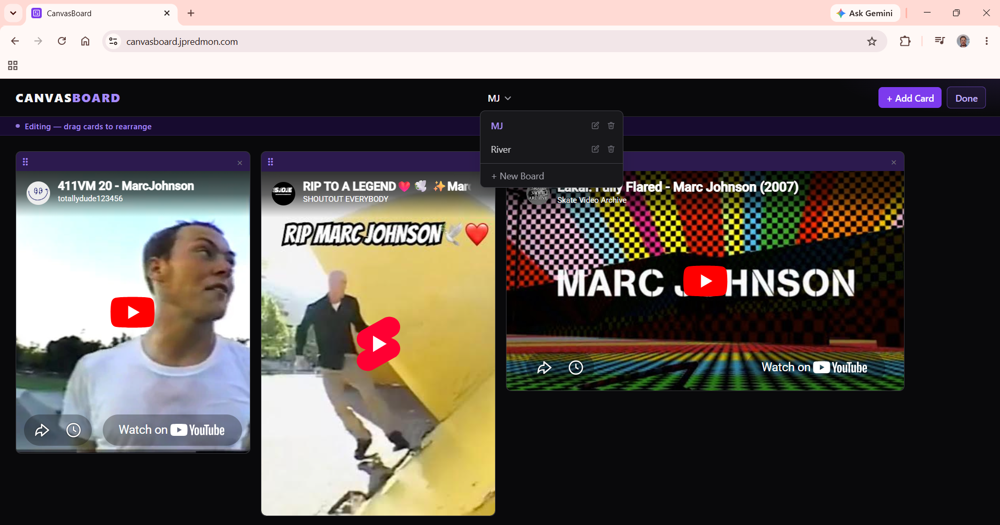

# CanvasBoard

**[canvasboard.jpredmon.com](https://canvasboard.jpredmon.com)**

A local-first visual media board where users curate embedded YouTube content on a free-placement, grid-snapped canvas. Built with React 18, TypeScript, Redux Toolkit, and React Grid Layout.



## Features

- **Multiple boards** — Create and switch between named boards
- **Add YouTube videos** — Paste any YouTube or YouTube Shorts URL
- **Free-placement canvas** — Drag cards anywhere, snap to grid
- **Edit/View modes** — Lock the board for clean presentation
- **Persistent storage** — Auto-saves to browser localStorage
- **Responsive grid** — 12-column layout, configurable card sizes
- **Dark theme** — Minimal UI, media-focused design
- **Accessibility** — WCAG 2.1 AA: keyboard navigation, skip link, reduced-motion, semantic headings, synced document title

## Project Status

Live at [canvasboard.jpredmon.com](https://canvasboard.jpredmon.com). Deployed via Cloudflare Pages with CI/CD on push to `master`.

All 5 planned phases complete: security, accessibility (WCAG 2.1 AA), code quality, testing (94 RTL unit tests + 5 Playwright E2E tests), and code style standards (ESLint import ordering, naming conventions, Prettier).

## Development Process

This project uses a structured AI-assisted workflow: each feature goes through a brainstorm → design spec → implementation plan → subagent execution → spec compliance review → code quality review cycle, with TDD throughout. Every task is implemented by a fresh subagent working from a complete spec, then reviewed by two independent review passes before merging. The result is a codebase where every change is tested, every decision is documented, and the review loop catches issues before they ship.

## Tech Stack

- **React 18** — UI framework
- **TypeScript (strict)** — Type safety
- **Vite** — Build tool
- **Tailwind CSS** — Styling
- **Redux Toolkit** — State management
- **React Grid Layout** — Free-placement canvas grid
- **Vitest + React Testing Library** — Unit/component testing
- **Playwright** — End-to-end browser testing (Chromium)
- **ESLint + Prettier** — Code quality

## Architecture

```
App
├── CanvasBoardPage (top-level page)
├── BoardHeader (title + add card button + edit toggle)
├── BoardDropdown (multi-board switcher)
├── AddCardModal (URL input with validation)
└── GridCanvas (React Grid Layout + MediaCard list)

Redux Store
├── boards — named board entities
├── cards — normalized entity map
├── layout — card positions & sizes
└── ui — modal state, edit mode flag

Repository Pattern
├── BoardRepository (interface)
└── LocalStorageRepository (localStorage impl)
```

## Quick Start

```bash
npm install
npm run dev
```

Visit `http://localhost:5173` in your browser.

## Development Commands

```bash
npm run dev          # Start dev server
npm run build        # Build for production
npm test             # Run unit/component tests (Vitest)
npm run test:e2e     # Run E2E tests (Playwright, auto-starts dev server)
npm run lint         # Check code style
npm run format       # Format code (Prettier)
```

## Testing

**Unit/component tests** — 94 tests across 17 files, co-located with source as `*.test.ts` / `*.test.tsx`. Vitest + React Testing Library with jsdom.

```bash
npm test                                    # Run all unit/component tests
npx vitest run src/components/board/        # Run tests in a folder
npx vitest watch                            # Watch mode
```

**E2E tests** — 5 Playwright tests in `e2e/`. Chromium only. The `webServer` config auto-starts the dev server; `reuseExistingServer: true` so a running dev server is reused.

```bash
npm run test:e2e                            # Run all E2E tests
npx playwright test e2e/golden-path.spec.ts # Run a single spec
npx playwright show-report                  # Open last test report
```

E2E coverage: golden path (create board → add YouTube card), board management (rename, switch, delete), and localStorage persistence across reload.

## Browser Support

- Chrome/Chromium (latest)
- Firefox (latest)
- Safari (latest)

Mobile layout not yet supported.

## Future Additions

- Additional media types (Instagram, TikTok, images)
- Board sharing via URL/QR code
- Keyboard shortcuts for power users
- Mobile-responsive layout
- Cloud persistence (Cloudflare D1 / Supabase)

## License

MIT
